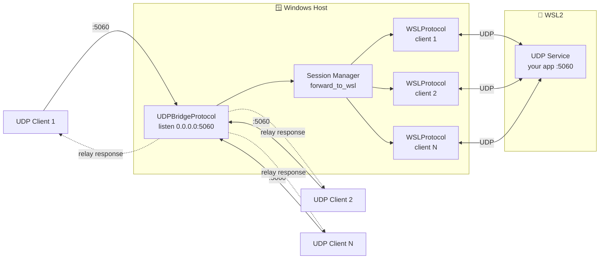
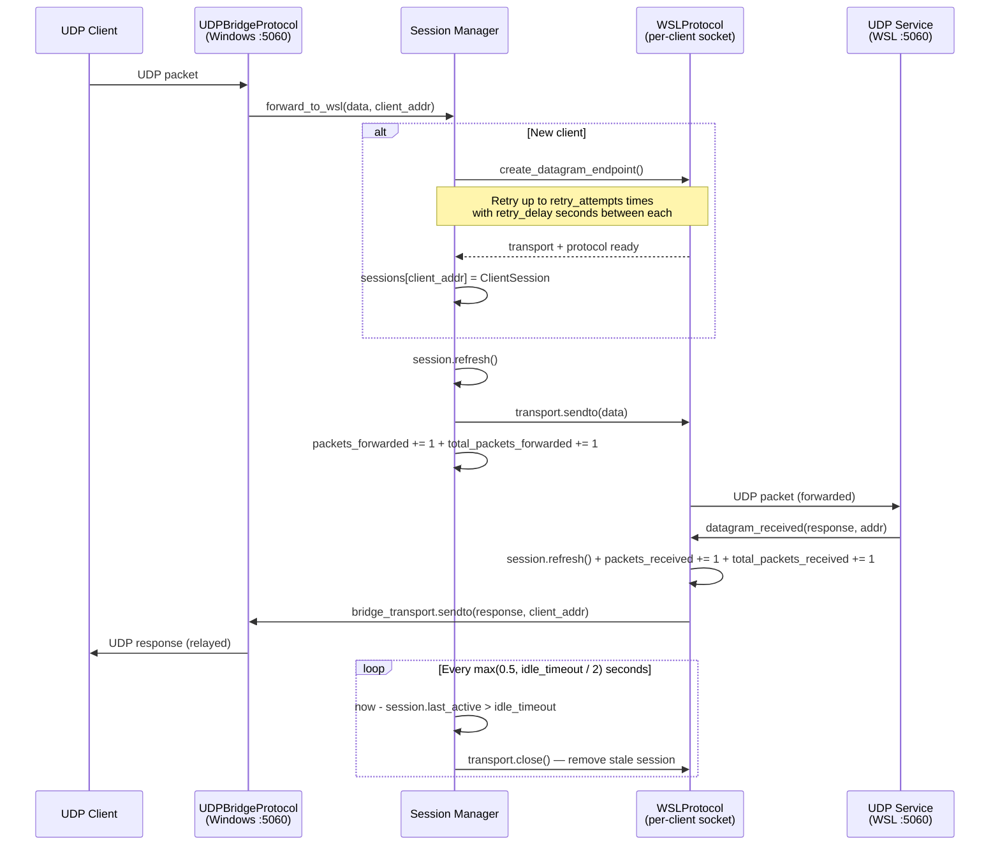

# UDP Windows-to-WSL Port Bridge

> Async UDP bridge that forwards packets between Windows and WSL2.


------------------------------------------------------------------------

## 📌 What Is This?

Windows has a built-in TCP port proxy (`netsh interface portproxy`), but it **does not
support UDP**. This project fills that gap.

**WindowsWslPortBridge** listens for UDP packets on a Windows port, forwards them to a
service inside WSL2, and relays responses back to the original sender. Each client gets
its own dedicated outbound socket so multiple concurrent flows never interfere with each
other.

It is written entirely in Python using `asyncio`, with zero external runtime dependencies.

------------------------------------------------------------------------

## 📋 Table of Contents

- [📌 What Is This?](#-what-is-this)
- [✨ Features](#-features)
- [🎬 Quick Demo](#-quick-demo)
- [🏗 Architecture](#-architecture)
- [🔎 How It Works](#-how-it-works)
- [⚙️ Installation](#️-installation)
- [▶️ Usage](#️-usage)
- [📊 Monitoring & Logging](#-monitoring--logging)
- [🧪 Running Tests](#-running-tests)
- [🧠 Design Decisions](#-design-decisions)
- [🛠 Use Cases](#-use-cases)
- [🐛 Troubleshooting](#-troubleshooting)
- [📄 License](#-license)
- [⭐ Contributing](#-contributing)
- [🔗 Related Projects](#-related-projects)

------------------------------------------------------------------------

## ✨ Features

- **UDP forwarding** — Windows → WSL2 and back
- **Fully async** — single-threaded `asyncio`, handles many clients concurrently
- **Per-client sessions** — each client gets its own WSL-bound socket to prevent packet mixing
- **Idle cleanup** — stale sessions are automatically removed on a timer
- **DoS protection** — configurable max session limit
- **Retry logic** — automatic retries when creating WSL connections
- **Zero dependencies** — only Python standard library at runtime
- **Graceful shutdown** — Ctrl+C cleanly closes all sessions and prints final stats
- **Structured logging** — configurable log levels with per-session detail

------------------------------------------------------------------------

## 🎬 Quick Demo

```powershell
# Terminal 1 (WSL): Start a UDP listener
wsl -e bash -c "nc -u -l -p 5060"

# Terminal 2 (Windows): Start the bridge
uv run udp-bridge --log-level DEBUG

# Terminal 3 (Windows): Send a test packet
python -c "import socket; s=socket.socket(socket.AF_INET, socket.SOCK_DGRAM); s.sendto(b'Hello WSL!', ('127.0.0.1', 5060))"
```

You should see `Hello WSL!` appear in Terminal 1.

------------------------------------------------------------------------

## 🏗 Architecture

### Component Diagram


### Data Flow


```mermaid
flowchart LR
    C1[UDP Client 1] -->|:5060| L
    C2[UDP Client 2] -->|:5060| L
    CN[UDP Client N] -->|:5060| L

    subgraph Windows ["🪟 Windows Host"]
        L[UDPBridgeProtocol\nlisten 0.0.0.0:5060]
        L --> SM[Session Manager\nforward_to_wsl]
        SM --> P1[WSLProtocol\nclient 1]
        SM --> P2[WSLProtocol\nclient 2]
        SM --> PN[WSLProtocol\nclient N]
    end

    subgraph WSL2 ["🐧 WSL2"]
        SVC[UDP Service\nyour app :5060]
    end

    P1 <-->|UDP| SVC
    P2 <-->|UDP| SVC
    PN <-->|UDP| SVC

    L -.->|relay response| C1
    L -.->|relay response| C2
    L -.->|relay response| CN
```

------------------------------------------------------------------------

## 🔎 How It Works

### Packet Flow (Sequence Diagram)


```mermaid
sequenceDiagram
    participant C as UDP Client
    participant B as UDPBridgeProtocol<br/>(Windows :5060)
    participant SM as Session Manager
    participant W as WSLProtocol<br/>(per-client socket)
    participant S as UDP Service<br/>(WSL :5060)

    C->>B: UDP packet
    B->>SM: forward_to_wsl(data, client_addr)

    alt New client
        SM->>W: create_datagram_endpoint()
        Note over SM,W: Retry up to retry_attempts times<br/>with retry_delay seconds between each
        W-->>SM: transport + protocol ready
        SM->>SM: sessions[client_addr] = ClientSession
    end

    SM->>SM: session.refresh()
    SM->>W: transport.sendto(data)
    SM->>SM: packets_forwarded += 1 + total_packets_forwarded += 1
    W->>S: UDP packet (forwarded)

    S->>W: datagram_received(response, addr)
    W->>W: session.refresh() + packets_received += 1 + total_packets_received += 1
    W->>B: bridge_transport.sendto(response, client_addr)
    B->>C: UDP response (relayed)

    loop Every max(0.5, idle_timeout / 2) seconds
        SM->>SM: now - session.last_active > idle_timeout
        SM->>W: transport.close() — remove stale session
    end
```

------------------------------------------------------------------------

## ⚙️ Installation

### Requirements

- **Python 3.10+**
- **[uv](https://docs.astral.sh/uv/)** — fast Python package manager (`pip install uv` or see [uv docs](https://docs.astral.sh/uv/getting-started/installation/))
- **Windows 10/11** with WSL2 installed
- **A WSL instance** running the UDP service you want to bridge to

### Quick Start

```powershell
# Clone the repository
git clone https://github.com/astralborn/WindowsWslPortBridge.git
cd WindowsWslPortBridge

# Set up the environment and install the package
uv sync

# Run the bridge
uv run udp-bridge
```

### Install with dev dependencies (for running tests and linting)

```powershell
uv sync --dev
```

### No External Runtime Dependencies

This bridge uses only Python standard library modules — no third-party packages are needed at runtime.

### Project Structure

```
WindowsWslPortBridge/
├── .github/workflows/ci.yml        ← CI pipeline (lint, typecheck, test)
├── .gitignore
├── AGENTS.md                       ← AI agent instructions
├── LICENSE
├── README.md
├── pyproject.toml
├── uv.lock                         ← pinned dependency lockfile
├── docs/
│   └── images/
│       └── architecture.svg        ← component diagram
├── tests/                          ← test suite (73 tests, 96% coverage)
│   ├── test_cli.py                 # CLI argument parsing & config creation
│   ├── test_config_and_utils.py    # BridgeConfig validation, detect_wsl_ip, logging
│   ├── test_integration.py         # End-to-end tests with real UDP sockets
│   ├── test_main_smoke.py          # Entry point subprocess smoke tests
│   ├── test_protocols.py           # UDPBridgeProtocol & WSLProtocol
│   └── test_service.py             # UDPBridgeService (session lifecycle, shutdown)
└── udp_win_wsl_bridge/             ← installable package
    ├── __init__.py                 # Package exports, version via importlib.metadata
    ├── __main__.py                 # Entry point (signal handling, asyncio.run)
    ├── cli.py                      # Argument parsing
    ├── config.py                   # Configuration dataclass & validation
    ├── logging_utils.py            # Logging setup
    ├── models.py                   # ClientSession data model
    ├── protocols.py                # asyncio DatagramProtocol implementations
    ├── py.typed                    # PEP 561 type marker
    ├── service.py                  # Main UDPBridgeService
    └── utils.py                    # WSL IP auto-detection
```

------------------------------------------------------------------------

## ▶️ Usage

### Basic Usage

```powershell
uv run udp-bridge
```

### Custom WSL IP

```powershell
uv run udp-bridge --wsl-host 172.25.224.1
```

### Custom Ports

```powershell
uv run udp-bridge --listen-port 9000 --wsl-port 9000
```

### Advanced Configuration

```powershell
uv run udp-bridge --listen-port 5060 --wsl-port 5060 --timeout 30 --max-sessions 5000 --log-level INFO
```

### Debug Mode

```powershell
uv run udp-bridge --log-level DEBUG
```

### All Parameters

| Argument           | Description                                   | Default |
|--------------------|-----------------------------------------------|---------|
| `--wsl-host`       | WSL IP address (auto-detected if omitted)     | auto    |
| `--listen-port`    | UDP port to listen on (Windows side)          | `5060`  |
| `--wsl-port`       | Target UDP port inside WSL                    | `5060`  |
| `--timeout`        | Idle session timeout in seconds               | `5.0`   |
| `--max-sessions`   | Maximum concurrent sessions                   | `1000`  |
| `--retry-attempts` | Max connection attempts per session (min 1)   | `3`     |
| `--retry-delay`    | Delay between retry attempts in seconds       | `1.0`   |
| `--log-level`      | Logging level: DEBUG / INFO / WARNING / ERROR | `INFO`  |

------------------------------------------------------------------------

## 📊 Monitoring & Logging

### Log Levels

- **DEBUG** — detailed packet flow, per-session stats every cleanup cycle
- **INFO** — session creation, shutdown events
- **WARNING** — retry attempts, session limit reached
- **ERROR** — connection failures, unexpected errors

### Example Output

```
[2026-04-03 12:00:00] udp_win_wsl_bridge.__main__ INFO: Starting UDP bridge: 5060 -> 172.25.224.1:5060
[2026-04-03 12:00:00] udp_win_wsl_bridge.protocols INFO: Listening on ('0.0.0.0', 5060) -> WSL 172.25.224.1:5060
[2026-04-03 12:00:05] udp_win_wsl_bridge.service INFO: Session created: ('192.168.1.100', 12345) (total: 1)
[2026-04-03 12:00:05] udp_win_wsl_bridge.service DEBUG: ('192.168.1.100', 12345) -> WSL (42 bytes)
[2026-04-03 12:00:05] udp_win_wsl_bridge.protocols DEBUG: WSL -> ('192.168.1.100', 12345) (42 bytes)
[2026-04-03 12:00:15] udp_win_wsl_bridge.service DEBUG: Active sessions: 1/1000, Total packets: 5 sent, 5 received
[2026-04-03 12:00:30] udp_win_wsl_bridge.service INFO: Shutting down bridge
[2026-04-03 12:00:30] udp_win_wsl_bridge.service INFO: Final stats: 1 sessions created, 5 packets sent, 5 packets received
```

### Graceful Shutdown

Press **Ctrl+C** to shut down cleanly — all active sessions are closed, pending
packets are flushed, and final statistics are printed.

------------------------------------------------------------------------

## 🧪 Running Tests

```powershell
# Install dev dependencies first (if not already done)
uv sync --dev

# Run all tests with coverage
uv run pytest --cov --cov-report=term-missing

# Run all tests (fast, no coverage)
uv run pytest --tb=short -q

# Run with verbose output
uv run pytest -v

# Run a specific test file
uv run pytest tests/test_service.py
uv run pytest tests/test_integration.py
```

### Test Suite Coverage

| Test file | What it covers | Tests |
|---|---|---|
| `test_service.py` | Session lifecycle, retry logic, cleanup loop, shutdown | 26 |
| `test_config_and_utils.py` | `BridgeConfig` validation, `detect_wsl_ip`, `setup_logging` | 23 |
| `test_protocols.py` | `UDPBridgeProtocol` & `WSLProtocol` behaviour | 10 |
| `test_cli.py` | Argument parsing, config creation, error exits | 8 |
| `test_integration.py` | End-to-end with real UDP sockets, concurrency stress | 2 |
| `test_main_smoke.py` | Entry point subprocess tests (`--help`, invalid args) | 2 |
| **Total** | **96% branch coverage** | **73** |

------------------------------------------------------------------------

## 🧠 Design Decisions

### Why per-client session mapping?

UDP is connectionless, but most protocols follow a request-response pattern.
Mapping one outbound socket per client prevents packet mixing between clients,
session state conflicts, and response routing errors.

### Why asyncio?

Non-blocking I/O lets a single thread handle many concurrent clients efficiently,
with minimal memory overhead and a clean event-driven structure.

### Why track forwarding tasks explicitly?

`asyncio.create_task()` without storing a reference allows the event loop to
garbage-collect tasks before they finish, silently dropping packets. Every
forwarding task is held in `_pending_tasks` and removed only on completion.

------------------------------------------------------------------------

## 🛠 Use Cases

- 🎮 Game server development inside WSL
- 📡 SIP / RTP testing
- 🌐 DNS service testing
- 📊 Telemetry & metrics pipelines
- 🔬 Custom UDP protocol development

------------------------------------------------------------------------

## 🐛 Troubleshooting

### "Port already in use" (WinError 10048)

```powershell
# Find what is using the port
netstat -ano | findstr :5060

# Kill it (replace 1234 with the actual PID)
taskkill /PID 1234 /F

# Or use a different port
uv run udp-bridge --listen-port 5061
```

### "ImportError: attempted relative import with no known parent package"

You ran `python __main__.py` from inside the `udp_win_wsl_bridge\` folder.
Use `uv run` from the project root instead:

```powershell
# Correct — from WindowsWslPortBridge\
uv run udp-bridge
```

### "WSL hostname command timed out" / auto-detect fails

```powershell
# Get your WSL IP manually
wsl hostname -I

# Pass it explicitly
uv run udp-bridge --wsl-host 172.25.224.1
```

### "Session limit reached"

```powershell
uv run udp-bridge --max-sessions 5000 --log-level DEBUG
```

### "Failed to create session after N attempts"

```powershell
# Increase retries and make sure your WSL service is running first
uv run udp-bridge --retry-attempts 5 --retry-delay 2.0
```

### General debugging

```powershell
uv run udp-bridge --log-level DEBUG
```

------------------------------------------------------------------------

## 📄 License

MIT License — see [LICENSE](LICENSE) for details.

**Author**: Stanislav Nikolaievskyi

------------------------------------------------------------------------

## ⭐ Contributing

Contributions, issues, and feature requests are welcome!

### Development Setup

```powershell
git clone https://github.com/astralborn/WindowsWslPortBridge.git
cd WindowsWslPortBridge
uv sync --dev
uv run pytest
```

### Linting & Type Checking

```powershell
uv run ruff check .
uv run ruff format --check .
uv run ty check udp_win_wsl_bridge
```

### Submitting Changes

1. Fork the repository
2. Create a feature branch
3. Add or update tests for your change
4. Submit a pull request

If you find this useful, consider giving it a ⭐ on GitHub!

------------------------------------------------------------------------

## 🔗 Related Projects

- [netsh interface portproxy](https://learn.microsoft.com/en-us/windows-server/networking/technologies/netsh/netsh-interface-portproxy) — Built-in Windows TCP port proxy (no UDP support)
- [WSL2 networking](https://learn.microsoft.com/en-us/windows/wsl/networking) — Official WSL networking documentation
